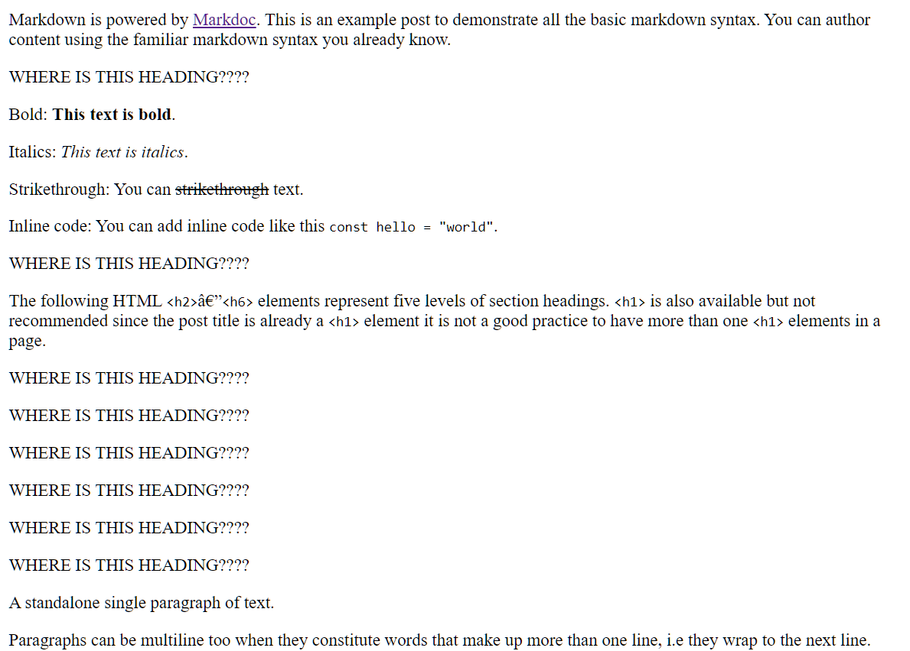

# astro markdoc config is completely ignored

Custom component `Heading.astro` is not getting applied on markdown content from content collection.

Completely following these 2 websites:
https://docs.astro.build/en/tutorials/add-content-collections/#create-a-collection-for-your-blog-posts
https://docs.astro.build/en/guides/integrations-guide/markdoc/#syntax-highlighting

## Steps to reproduce

Install dependecies and run development server
```sh
npm install
npm run dev
```

## Expected result


## Actual result

